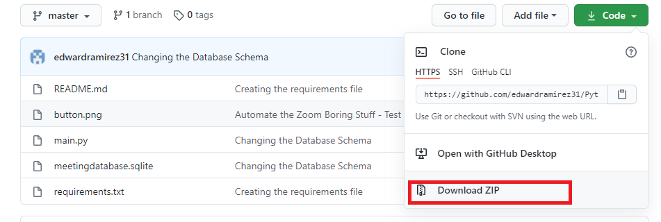
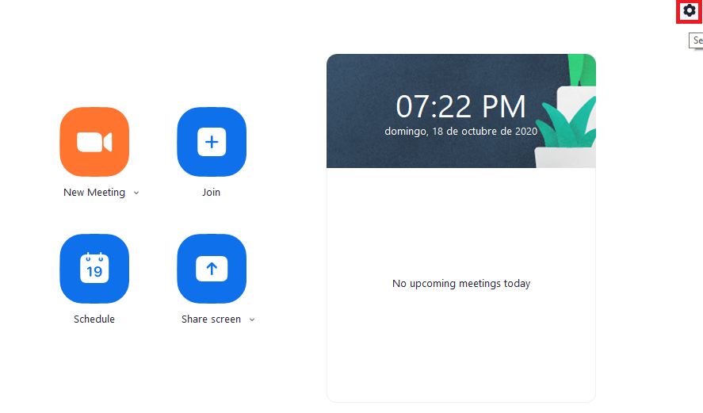
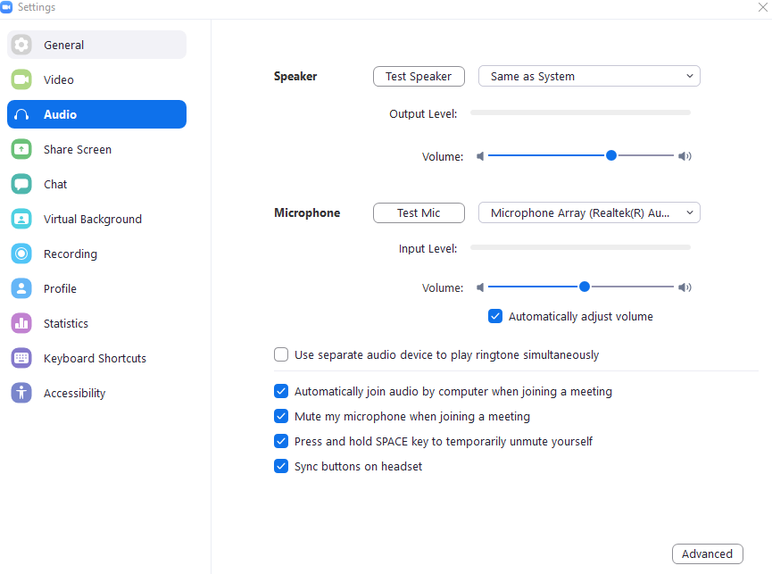
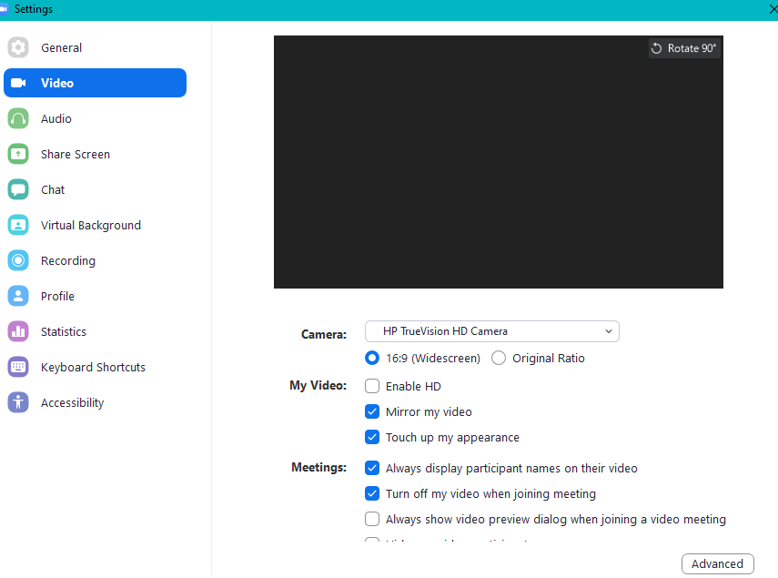
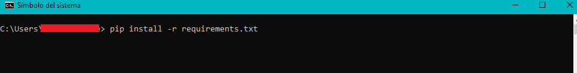
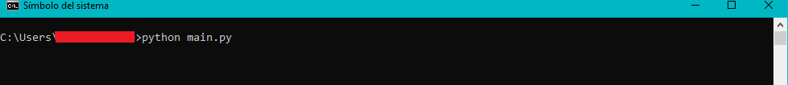

# Python-Automation

## Requirements

---

1. Download and Install [Python](https://www.python.org/downloads/)

2. Download the ZIP file:
   

3. Unzip the file and put the folder content **(each file within the unziped folder)** in your **User Folder**

   - Tipically, in Windows the User folder follows the Path "C:\Users\\{YourUserNameHere}"

4. Set the Zoom audio and video configuration:
   
   
   

5. Open the command line

   - You can use CMD or Windows Powershell
   - Once you are in the command line, type the following line
     

6. Run the Python script typing the following line in the Shell
   
